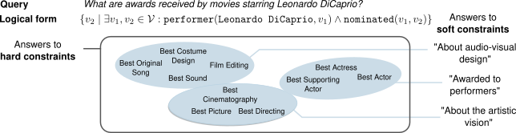

# Query Answering with Soft Entity Constraints

This is the code repository accompanying the paper Interactive Query Answering on Knowledge Graphs with Soft Entity Constraints.

Logical queries over knowledge graphs allow retrieving entities that meet constraints defined by logical formulas. In this project, we extend these with **soft constraints** that allow specifying that in addition to the logical constraints, an entity should be "like" or "unlike" specific exemplary entities:



If you find our work interesting, please use the following citation:

```bibtex
@article{
daza2026interactive,
title={Interactive Query Answering on Knowledge Graphs with Soft Entity Constraints},
author={Daniel Daza and Alberto Bernardi and Luca Costabello and Christophe Gueret and Masoud Mansoury and Michael Cochez and M.C. Schut},
journal={Transactions on Machine Learning Research},
issn={2835-8856},
year={2026},
url={https://openreview.net/forum?id=Qb6vIM7MxE}
}
```

## Replicating our experiments

### 1. Installation

Use the following to create and environment with `conda` and install the requirements:

```bash
conda create -n nqr python=3.12
conda activate nqr
pip install -r requirements.txt
```

### 2. Download the data

In our work, we introduce query-answering datasets extended with soft entity constraints. We provide these datasets on Zenodo:

https://doi.org/10.5281/zenodo.20847352

Download and extract the dataset archives from the repository root:

- `fb15k237-betae.tar.gz`
- `hetionet.tar.gz`

```bash
mkdir -p data

tar xzf fb15k237-betae.tar.gz -C data
tar xzf hetionet.tar.gz -C data
```

The same Zenodo record also contains pretrained artifacts and raw experimental results, which can be used to reproduce the experiments and figures without retraining:

- `fb15k237-betae_10_0.0002_nonforced.tar.gz`
- `hetionet_10_0.001_nonforced.tar.gz`
- `results.tar.gz`

Extract them with:

```bash
mkdir -p neural_adj

tar xzf fb15k237-betae_10_0.0002_nonforced.tar.gz -C neural_adj
tar xzf hetionet_10_0.001_nonforced.tar.gz -C neural_adj

tar xzf results.tar.gz
```

### 3. Reproducing our experiments

The main entrypoint is the module `nqr.qto.query`. Given a dataset and a model, the module can train and test different methods for query answering with soft entity constraints.
We provide configuration files for all our experiments in the `configs` directory. As an example, to test the Cosine method on the FB15k237 dataset, run

```shell
python -m nqr.qto.query --config configs/fb15k237/cosine.yaml
```

The generated results will be stored in the `results` directory.

### 4. Replicating our results

Since we provide raw experimental results, it is also possible to replicate the figures and tables in our paper without the need to repeat the experiments. To replicate **Fig. 1**, run

```shell
python analysis/plots.py
```

To replicate **Table 3**, run

```shell
python analysis/tables.py
```
